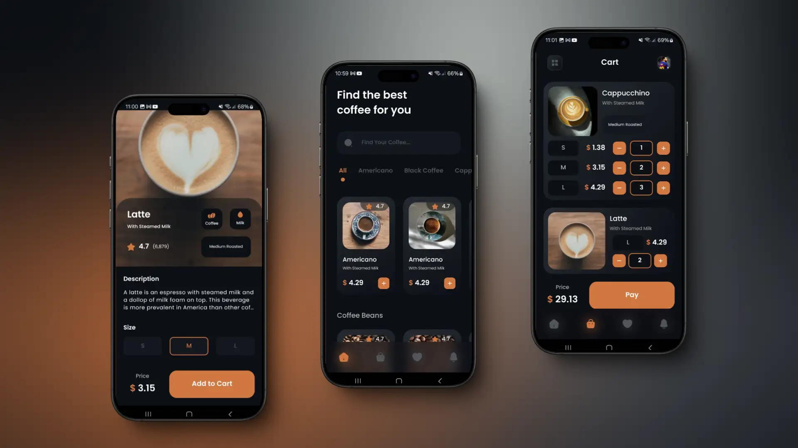
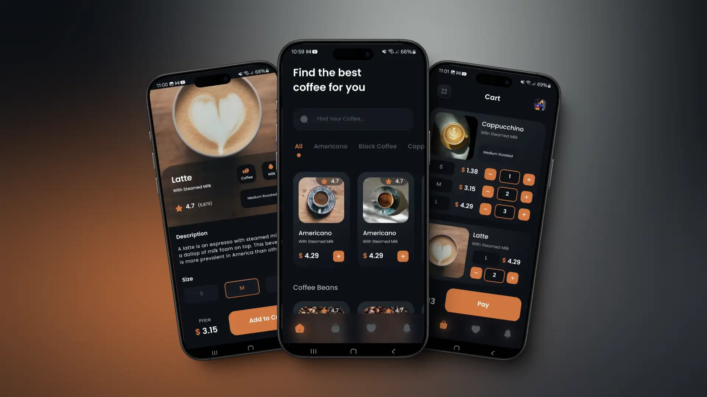
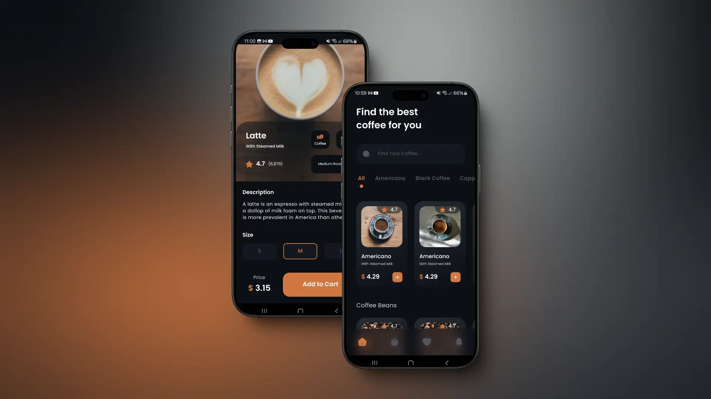

# About the App 

This is a Coffee Shop App built by `Diego Tech` by using:

- React Native
- TypeScript

<br />





<br />

## I used the Libraries 🚀

- React Native Navigation
- Zustand
- Immer
- React Native Async Storage
- React Native Linear Gradient
- React Native Community Blur
- Lottie React Native
- React Native Vector Icons

### One message for Everyone 🔥

> [!TIP]
> ```shell
> Aguante Argentina!!!
> Aguante Messi!!!
> ```
